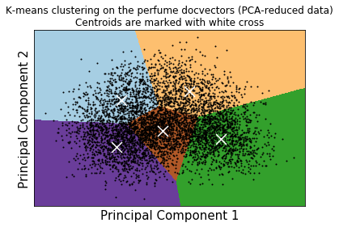
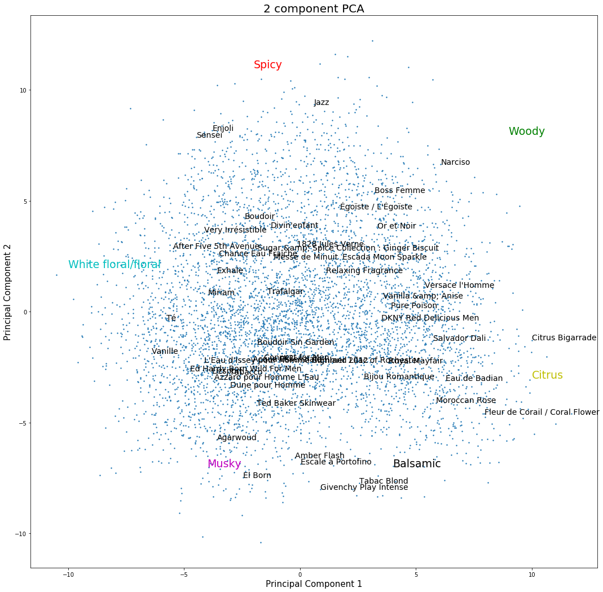

# deep-perfumes-potion-app
Fragrance recommendation engine trained on user reviews using natural language processing

Try the app on <a href="http://www.potionfinder.com">potionfinder.com</a>

Trained on over 140k user reviews on nearly 6k fragrances scraped from basenotes.com (pulled in 04/2018). Uses gensim doc2vec to find associations between different fragrances and keywords (e.g. floral, vanilla, etc.)


Model training and background on potionfinder.com

Import pandas to look at the scrapped dataset and import gensim to deploy doc2vec


```python
import pandas as pd
import gensim
```


```python
df = pd.read_csv('perfumedf_inproduction.csv')
```

The dataset contains information on the maker, perfume name, rating, year introduced, gender, and review. For this model, we will use only the perfume name (doc tag) and review (corpus).


```python
df.head()
```


<div>
<table border="1" class="dataframe">
  <thead>
    <tr style="text-align: right;">
      <th></th>
      <th>availability</th>
      <th>gender</th>
      <th>maker</th>
      <th>perfume</th>
      <th>rating</th>
      <th>review</th>
      <th>year</th>
    </tr>
  </thead>
  <tbody>
    <tr>
      <th>0</th>
      <td>In Production</td>
      <td>Masculine</td>
      <td>Versace</td>
      <td>Versace l'Homme</td>
      <td>3.728814</td>
      <td>My review is for the current formulation. L'Ho...</td>
      <td>1984</td>
    </tr>
    <tr>
      <th>1</th>
      <td>In Production</td>
      <td>Shared / Unisex</td>
      <td>Alyssa Ashley</td>
      <td>Musk</td>
      <td>3.303571</td>
      <td>Citrus, Jasmine, Musk, Rose, Carnation, Coumar...</td>
      <td>1968</td>
    </tr>
    <tr>
      <th>2</th>
      <td>In Production</td>
      <td>Feminine</td>
      <td>Stephen Jones</td>
      <td>Stephen Jones</td>
      <td>3.396825</td>
      <td>A HUGE burst of aldehydes quickly dries down t...</td>
      <td>2008</td>
    </tr>
    <tr>
      <th>3</th>
      <td>In Production</td>
      <td>Feminine</td>
      <td>Editions de Parfums Frederic Malle</td>
      <td>Portrait of a Lady</td>
      <td>4.265672</td>
      <td>I imagine there is not one perfume I would (li...</td>
      <td>2010</td>
    </tr>
    <tr>
      <th>4</th>
      <td>In Production</td>
      <td>Masculine</td>
      <td>Versace</td>
      <td>Versace pour Homme Oud Noir</td>
      <td>4.000000</td>
      <td>Bitter Orange, Neroli, Pepper.Cardamom, Saffro...</td>
      <td>2013</td>
    </tr>
  </tbody>
</table>
</div>


Define a function to preprocess the reviews for training with gensim


```python
def read_corpus(documents):
    for i, text in enumerate(documents):
        test = text
        try:
            yield gensim.models.doc2vec.TaggedDocument(gensim.utils.simple_preprocess(text), [df.perfume[i]])
        except TypeError:
            print(test)
            pass
```

There are a few nan errors, likely from empty reviews. We can safely ignore these.


```python
train_corpus = list(read_corpus(df.review))
```

    nan
    nan
    nan
    nan
    nan
    nan
    nan
    nan
    nan


Here's a couple of example reviews in our corpus. A large fraction of the words are adjectives that describe the fragrance.


```python
train_corpus[:2]
```


    [TaggedDocument(words=['my', 'review', 'is', 'for', 'the', 'current', 'formulation', 'homme', 'is', 'hands', 'down', 'the', 'best', 'masculine', 'fragrance', 'from', 'versace', 'though', 'the', 'competition', 'isn', 'very', 'stiff', 'it', 'is', 'classic', 'woody', 'leather', 'fragrance', 'it', 'opens', 'at', 'the', 'beginning', 'with', 'clean', 'sparkling', 'citrus', 'notes', 'of', 'lemon', 'the', 'citrus', 'gives', 'way', 'to', 'sharp', 'but', 'smooth', 'leather', 'note', 'with', 'hint', 'of', 'florals', 'as', 'the', 'woody', 'character', 'of', 'the', 'fragrance', 'comes', 'into', 'its', 'own', 'the', 'woody', 'leather', 'theme', 'is', 'retained', 'in', 'the', 'dry', 'down', 'as', 'the', 'floral', 'element', 'makes', 'room', 'for', 'faint', 'musky', 'note', 'homme', 'is', 'very', 'versatile', 'fragrance', 'with', 'decent', 'projection', 'and', 'longevity', 'it', 'not', 'my', 'favourite', 'fragrance', 'in', 'its', 'genre', 'prefer', 'the', 'superb', 'van', 'cleef', 'amp', 'arpels', 'pour', 'homme', 'nonetheless', 'it', 'still', 'solid', 'fragrance'], tags=["Versace l'Homme"]),
     TaggedDocument(words=['citrus', 'jasmine', 'musk', 'rose', 'carnation', 'coumarin', 'amber', 'vanilla', 'orris', 'root', 'suppose', 'the', 'first', 'things', 'noticed', 'after', 'applying', 'musk', 'extreme', 'was', 'that', 'it', 'immediately', 'performed', 'like', 'conventional', 'eau', 'de', 'toilette', 'and', 'it', 'possessed', 'slight', 'hairspray', 'accord', 'does', 'that', 'mean', 'it', 'was', 'an', 'instantaneous', 'deal', 'breaker', 'no', 'it', 'wasn', 'off', 'putting', 'because', 'the', 'hairspray', 'aura', 'wasn', 'sharp', 'like', 'some', 'can', 'be', 'yet', 'is', 'it', 'evident', 'am', 'saying', 'that', 'like', 'it', 'can', 'say', 'that', 'do', 'but', 'don', 'hate', 'it', 'have', 'few', 'fragrances', 'by', 'alyssa', 'ashley', 'that', 'wear', 'but', 'this', 'particular', 'one', 'leans', 'far', 'too', 'feminine', 'for', 'me', 'and', 'it', 'also', 'one', 'cannot', 'generate', 'any', 'love', 'for', 'it', 'goes', 'on', 'oily', 'as', 'well', 'so', 'expect', 'some', 'topical', 'residue', 'for', 'awhile', 'this', 'may', 'well', 'be', 'one', 'that', 'interacts', 'better', 'with', 'some', 'sort', 'of', 'base', 'but', 'have', 'neither', 'the', 'time', 'or', 'inclination', 'to', 'experiment', 'when', 'wear', 'musk', 'guess', 'expect', 'sensuality', 'to', 'be', 'present', 'or', 'at', 'least', 'some', 'type', 'of', 'animalic', 'aspect', 'augmenting', 'the', 'surrounding', 'notes', 'unfortunately', 'don', 'realize', 'that', 'with', 'musk', 'extreme', 'there', 'warm', 'herbaceous', 'and', 'spicy', 'quality', 'present', 'along', 'with', 'some', 'sharper', 'floral', 'elements', 'that', 'create', 'the', 'hairspray', 'comparison', 'cannot', 'help', 'but', 'mentally', 'correlate', 'the', 'aroma', 'to', 'drugstore', 'normally', 'enjoy', 'breaking', 'scent', 'down', 'to', 'explain', 'what', 'notes', 'are', 'doing', 'what', 'for', 'me', 'as', 'wear', 'it', 'won', 'do', 'that', 'here', 'since', 'the', 'above', 'is', 'basically', 'what', 'experience', 'through', 'the', 'life', 'of', 'the', 'scent', 'with', 'the', 'exception', 'of', 'mild', 'vanilla', 'peeking', 'through', 'in', 'the', 'base', 'and', 'beyond', 'sillage', 'is', 'average', 'with', 'longevity', 'approximately', 'hours', 'on', 'my', 'skin', 'with', 'heavy', 'sprays', 'it', 'does', 'last', 'longer', 'as', 'skin', 'scent', 'neutral', 'rating', 'from', 'ss', 'for', 'alyssa', 'ashley', 'musk', 'extreme', 'and', 'as', 'always', 'sample', 'wear', 'is', 'highly', 'recommended'], tags=['Musk'])]


Here we train three different models for comparison: 1) "model": distributed memory model, 2) "model_subsample": distributed memory model with subsampling frequency 1e-5, 3) "model_dbow": distributed bag of words model with negative sampling
(other models were tried as well, but not included here)


```python
model = gensim.models.doc2vec.Doc2Vec(size=50, dm=1, min_count=2, iter=50)
model.build_vocab(train_corpus)
%time model.train(train_corpus, total_examples=model.corpus_count, epochs=model.iter)
```

    /Library/Frameworks/Python.framework/Versions/3.6/lib/python3.6/site-packages/gensim/models/doc2vec.py:362: UserWarning: The parameter `iter` is deprecated, will be removed in 4.0.0, use `epochs` instead.
      warnings.warn("The parameter `iter` is deprecated, will be removed in 4.0.0, use `epochs` instead.")
    /Library/Frameworks/Python.framework/Versions/3.6/lib/python3.6/site-packages/gensim/models/doc2vec.py:366: UserWarning: The parameter `size` is deprecated, will be removed in 4.0.0, use `vector_size` instead.
      warnings.warn("The parameter `size` is deprecated, will be removed in 4.0.0, use `vector_size` instead.")
    /Library/Frameworks/Python.framework/Versions/3.6/lib/python3.6/site-packages/ipykernel_launcher.py:1: DeprecationWarning: Call to deprecated `iter` (Attribute will be removed in 4.0.0, use self.epochs instead).
      """Entry point for launching an IPython kernel.


    CPU times: user 25min 18s, sys: 2min, total: 27min 18s
    Wall time: 12min 30s


```python
model_subsample = gensim.models.doc2vec.Doc2Vec(size=50, dm=1, min_count=2, iter=100, sample=1e-5)
model_subsample.build_vocab(train_corpus)
%time model_subsample.train(train_corpus, total_examples=model_subsample.corpus_count, epochs=model.iter)
```

    /Library/Frameworks/Python.framework/Versions/3.6/lib/python3.6/site-packages/gensim/models/doc2vec.py:362: UserWarning: The parameter `iter` is deprecated, will be removed in 4.0.0, use `epochs` instead.
      warnings.warn("The parameter `iter` is deprecated, will be removed in 4.0.0, use `epochs` instead.")
    /Library/Frameworks/Python.framework/Versions/3.6/lib/python3.6/site-packages/gensim/models/doc2vec.py:366: UserWarning: The parameter `size` is deprecated, will be removed in 4.0.0, use `vector_size` instead.
      warnings.warn("The parameter `size` is deprecated, will be removed in 4.0.0, use `vector_size` instead.")
    /Library/Frameworks/Python.framework/Versions/3.6/lib/python3.6/site-packages/ipykernel_launcher.py:1: DeprecationWarning: Call to deprecated `iter` (Attribute will be removed in 4.0.0, use self.epochs instead).
      """Entry point for launching an IPython kernel.


    CPU times: user 13min 1s, sys: 1min 53s, total: 14min 55s
    Wall time: 9min 22s


```python
model_dbow = gensim.models.doc2vec.Doc2Vec(size=50, dm=0, min_count=2, negative=5, iter=50)
model_dbow.build_vocab(train_corpus)
%time model_dbow.train(train_corpus, total_examples=model_dbow.corpus_count, epochs=model_dbow.iter)
```

    /Library/Frameworks/Python.framework/Versions/3.6/lib/python3.6/site-packages/gensim/models/doc2vec.py:362: UserWarning: The parameter `iter` is deprecated, will be removed in 4.0.0, use `epochs` instead.
      warnings.warn("The parameter `iter` is deprecated, will be removed in 4.0.0, use `epochs` instead.")
    /Library/Frameworks/Python.framework/Versions/3.6/lib/python3.6/site-packages/gensim/models/doc2vec.py:366: UserWarning: The parameter `size` is deprecated, will be removed in 4.0.0, use `vector_size` instead.
      warnings.warn("The parameter `size` is deprecated, will be removed in 4.0.0, use `vector_size` instead.")
    /Library/Frameworks/Python.framework/Versions/3.6/lib/python3.6/site-packages/ipykernel_launcher.py:1: DeprecationWarning: Call to deprecated `iter` (Attribute will be removed in 4.0.0, use self.epochs instead).
      """Entry point for launching an IPython kernel.


    CPU times: user 18min 39s, sys: 1min 1s, total: 19min 40s
    Wall time: 9min 17s


Here we plot the most similar perfumes to the input search "flowerbomb," a popular floral perfume.


```python
from pprint import pprint
import difflib
print(difflib.get_close_matches('flowerbomb', df.perfume, 1))
pprint(model.docvecs.most_similar(positive=difflib.get_close_matches('flowerbomb', df.perfume, 1)))
```

    ['Flowerbomb']
    [('La Vie Est Belle', 0.9068676829338074),
     ('Fantasy', 0.8576025366783142),
     ('Hypnotic Poison Eau Sensuelle', 0.8547535538673401),
     ('Amor Amor', 0.833472728729248),
     ('Angel', 0.8286411762237549),
     ('Innocent', 0.8275986909866333),
     ('Pink Sugar', 0.8268875479698181),
     ('Dior Addict', 0.8207124471664429),
     ('Princess', 0.8204767107963562),
     ('Fancy', 0.818396806716919)]


```python
print(difflib.get_close_matches('flowerbomb', df.perfume, 1))
pprint(model_subsample.docvecs.most_similar(positive=difflib.get_close_matches('flowerbomb', df.perfume, 1)))
```

    ['Flowerbomb']
    [('Elie Saab Le Parfum', 0.6733473539352417),
     ('La Vie Est Belle', 0.6725860834121704),
     ('Hugo Pure Purple', 0.6673982739448547),
     ('Can Can Paris Hilton', 0.662361741065979),
     ('Innocent', 0.6582825779914856),
     ('Wish', 0.653344988822937),
     ('Angel', 0.6532328128814697),
     ('Hypnôse', 0.638688862323761),
     ('Valentina', 0.6378148794174194),
     ('Hypnotic Poison Eau Sensuelle', 0.6337730884552002)]


```python
print(difflib.get_close_matches('flowerbomb', df.perfume, 1))
pprint(model_dbow.docvecs.most_similar(positive=difflib.get_close_matches('flowerbomb', df.perfume, 1)))
```

    ['Flowerbomb']
    [('Lady Million', 0.6606640219688416),
     ('Angel', 0.6344294548034668),
     ('Coco Mademoiselle', 0.6332682967185974),
     ('Can Can Paris Hilton', 0.6219345331192017),
     ('Midnight Fleur ', 0.6206961870193481),
     ('Princess', 0.5972833633422852),
     ('Façonnable', 0.5862533450126648),
     ("Prada Candy L'Eau", 0.5842074155807495),
     ('Love and Luck for Women', 0.5827651023864746),
     ('Baby Phat Golden Goddess', 0.5803308486938477)]


Overall, the models distributed memory models identify some of the same perfumes as being most similar to "flowerbomb." However, the subsampled model has lower cosine similarities across the board. It is likely that subsampling is unnecessary for our corpus, as many of the words in the reviews are adjectives that describe the perfumes, and subsampling may get rid of some essential words.

The distributed bag of words model predicts somewhat different perfumes in association with "flowerbomb." Due to the qualitative nature of these associations, it is impossible to perform a rigorous validation of this model. Instead, we cross-validated these predictions with the "main accords" section on the website "fragrantica.com" and found that the distributed memory model without subsampling performs the best. The perfume "La Vie Est Belle" is frequently mentioned in online blog posts about perfumes similar to "flowerbomb."

Here are some of the perfumes that are negatively associated with "flowerbomb."


```python
print(difflib.get_close_matches('flowerbomb', df.perfume, 1))
pprint(model.docvecs.most_similar(negative=difflib.get_close_matches('flowerbomb', df.perfume, 1)))
```

    ['Flowerbomb']
    [('Vétiver de Puig', 0.3639378249645233),
     ('Eau des 4 Voleurs', 0.3377259373664856),
     ('Vetiver Hombre', 0.33085447549819946),
     ('Granville', 0.3308256268501282),
     ('Vetiver Royal Bourbon (new)', 0.3240063488483429),
     ('Equipage Géranium', 0.3225073218345642),
     ('Epicéa', 0.31838464736938477),
     ('Cyprès-Musc', 0.3181285858154297),
     ('Grafton', 0.3177714943885803),
     ('Mazzolari', 0.3166521489620209)]


```python
print(difflib.get_close_matches('flowerbomb', df.perfume, 1))
pprint(model_subsample.docvecs.most_similar(negative=difflib.get_close_matches('flowerbomb', df.perfume, 1)))
```

    ['Flowerbomb']
    [('Oud Minérale', 0.3414488434791565),
     ('The Fragrance Journals : 1962', 0.3396926820278168),
     ('Let Me Play The Lion', 0.3237929344177246),
     ("L'Eau Trois", 0.31123262643814087),
     ('Krizia Uomo', 0.30889806151390076),
     ('Bois Marocain', 0.30583417415618896),
     ('Cittá di Kyoto', 0.3043147623538971),
     ('Phoenicia', 0.3034292161464691),
     ('Marquis', 0.30006200075149536),
     ('Tom Ford Noir Anthracite', 0.2983548641204834)]


Again, these negative associations are difficult to evaluate, but one observation that jumps out is that the perfumes predicted to be most dissimilar to "flowerbomb" are all rather masculine. This makes sense, as "flowerbomb" is a particularly feminine fragrance.

We can also look at keyword associations, such as "floral." We find that generally the keyword associations match fairly well with the notes found in the predicted fragrances.


```python
vec = model.infer_vector(['floral'])
model.docvecs.most_similar(positive=[vec], topn=20)
```


    [('Musc et Freesia', 0.7333232760429382),
     ('Armani Privé Oranger Alhambra', 0.7259052395820618),
     ('Isotta Fraschini Profumo Uomo', 0.725715160369873),
     ('Armani Code Summer', 0.7133941650390625),
     ('Allure Homme Edition Blanche Eau de Parfum', 0.7128512263298035),
     ('Chloé Rose Edition', 0.7128045558929443),
     ("Ciel d'Airain", 0.7006070613861084),
     ('Ursa', 0.699537992477417),
     ('Nanadebary Bronze', 0.6992456316947937),
     ('Rose Velours', 0.6985301971435547),
     ('Fleurs de Bulgarie (original)', 0.6977048516273499),
     ('Cool Water Happy Summer', 0.6940541863441467),
     ('White Petals', 0.6886289119720459),
     ("L'Eau d'Issey Une Goutte de Nuage", 0.6858271360397339),
     ('Seveline - Vanille Bourbon / Bourbon Vanilla', 0.6853796243667603),
     ('Caprifoglio', 0.6816223859786987),
     ('Alien: Liqueur de Parfum', 0.6795877814292908),
     ('Mitsouko Fleur de Lotus', 0.6792057752609253),
     ('Love of Pink', 0.6771363019943237),
     ('Sheer Beauty', 0.668280839920044)]


```python
model.save_word2vec_format('doc_tensor_perfume.w2v', doctag_vec=True, word_vec=False, binary=False)
```


```python
model.save('doc_tensor_perfume.doc2vec')
```

Let's look at whether any interesting clusters emerge using kmeans


```python
from sklearn.cluster import KMeans
```


```python
doc_vectors = model.docvecs.doctag_syn0
```

    /Library/Frameworks/Python.framework/Versions/3.6/lib/python3.6/site-packages/ipykernel_launcher.py:1: DeprecationWarning: Call to deprecated `doctag_syn0` (Attribute will be removed in 4.0.0, use docvecs.vectors_docs instead).
      """Entry point for launching an IPython kernel.


Some articles suggest that there are 5 main types of perfumes: oriental, woody/earthy, sweet, flowery/fruity, and fresh. Let's perform kmeans on 5 clusters.


```python
num_clusters = 5
```


```python
kmeans_clustering = KMeans( n_clusters = num_clusters )
```


```python
idx = kmeans_clustering.fit_predict( doc_vectors )
```

Here we put the classified label with our perfumes.


```python
d = []
word_centroid_list = list(zip(model.docvecs.offset2doctag, idx))
word_centroid_list_sort = sorted(word_centroid_list, key=lambda el: el[1], reverse=False)
for word_centroid in word_centroid_list_sort:
    line = word_centroid[0] + '\t' + str(word_centroid[1]) + '\n'
    #print(line)
    d.append({'perfume': word_centroid[0], 'category': word_centroid[1]})
```


```python
df = pd.DataFrame(d)
```

<div>
<table border="1" class="dataframe">
  <thead>
    <tr style="text-align: right;">
      <th></th>
      <th>category</th>
      <th>perfume</th>
    </tr>
  </thead>
  <tbody>
    <tr>
      <th>0</th>
      <td>0</td>
      <td>Versace l'Homme</td>
    </tr>
    <tr>
      <th>1</th>
      <td>0</td>
      <td>Sycomore Eau de Toilette</td>
    </tr>
    <tr>
      <th>2</th>
      <td>0</td>
      <td>Original English Lavender / English Lavender</td>
    </tr>
    <tr>
      <th>3</th>
      <td>0</td>
      <td>Erolfa</td>
    </tr>
    <tr>
      <th>4</th>
      <td>0</td>
      <td>Vétiver Extraordinaire</td>
    </tr>
    <tr>
      <th>5</th>
      <td>0</td>
      <td>Eloge du Traitre</td>
    </tr>
    <tr>
      <th>6</th>
      <td>0</td>
      <td>Eaux de Caron Forte</td>
    </tr>
    <tr>
      <th>7</th>
      <td>0</td>
      <td>Cuba</td>
    </tr>
    <tr>
      <th>8</th>
      <td>0</td>
      <td>Italian Bergamot</td>
    </tr>
    <tr>
      <th>9</th>
      <td>0</td>
      <td>Je Suis Un Homme</td>
    </tr>
    <tr>
      <th>10</th>
      <td>0</td>
      <td>Stetson</td>
    </tr>
    <tr>
      <th>11</th>
      <td>0</td>
      <td>Monocle Scent Two: Laurel</td>
    </tr>
    <tr>
      <th>12</th>
      <td>0</td>
      <td>New Zealand</td>
    </tr>
    <tr>
      <th>13</th>
      <td>0</td>
      <td>Worth pour Homme</td>
    </tr>
    <tr>
      <th>14</th>
      <td>0</td>
      <td>Moschino pour Homme</td>
    </tr>
    <tr>
      <th>15</th>
      <td>0</td>
      <td>New-York</td>
    </tr>
    <tr>
      <th>16</th>
      <td>0</td>
      <td>Epicéa</td>
    </tr>
    <tr>
      <th>17</th>
      <td>0</td>
      <td>Mugler Cologne</td>
    </tr>
    <tr>
      <th>18</th>
      <td>0</td>
      <td>Quorum</td>
    </tr>
    <tr>
      <th>19</th>
      <td>0</td>
      <td>Green Valley</td>
    </tr>
    <tr>
      <th>20</th>
      <td>0</td>
      <td>L'Ame d'un Héros</td>
    </tr>
    <tr>
      <th>21</th>
      <td>0</td>
      <td>Endymion</td>
    </tr>
    <tr>
      <th>22</th>
      <td>0</td>
      <td>masculin Pluriel</td>
    </tr>
    <tr>
      <th>23</th>
      <td>0</td>
      <td>A Taste of Heaven</td>
    </tr>
    <tr>
      <th>24</th>
      <td>0</td>
      <td>Gentlemen Only</td>
    </tr>
    <tr>
      <th>25</th>
      <td>0</td>
      <td>1881 pour Homme</td>
    </tr>
    <tr>
      <th>26</th>
      <td>0</td>
      <td>Bijan for Men</td>
    </tr>
    <tr>
      <th>27</th>
      <td>0</td>
      <td>Rive Gauche pour Homme</td>
    </tr>
    <tr>
      <th>28</th>
      <td>0</td>
      <td>Grey Flannel</td>
    </tr>
    <tr>
      <th>29</th>
      <td>0</td>
      <td>Replica At the Barber's</td>
    </tr>
    <tr>
      <th>...</th>
      <td>...</td>
      <td>...</td>
    </tr>
    <tr>
      <th>822</th>
      <td>0</td>
      <td>Citrus Verbena Intensa</td>
    </tr>
    <tr>
      <th>823</th>
      <td>0</td>
      <td>F!</td>
    </tr>
    <tr>
      <th>824</th>
      <td>0</td>
      <td>Index Bergamot Citrus</td>
    </tr>
    <tr>
      <th>825</th>
      <td>0</td>
      <td>Baraja</td>
    </tr>
    <tr>
      <th>826</th>
      <td>0</td>
      <td>Mojo</td>
    </tr>
    <tr>
      <th>827</th>
      <td>0</td>
      <td>Tobacco Flower</td>
    </tr>
    <tr>
      <th>828</th>
      <td>0</td>
      <td>Aromatonic</td>
    </tr>
    <tr>
      <th>829</th>
      <td>0</td>
      <td>Jardin du Néroli</td>
    </tr>
    <tr>
      <th>830</th>
      <td>0</td>
      <td>Clean Perfume</td>
    </tr>
    <tr>
      <th>831</th>
      <td>0</td>
      <td>LiboCedro</td>
    </tr>
    <tr>
      <th>832</th>
      <td>0</td>
      <td>Agua de Sandalo</td>
    </tr>
    <tr>
      <th>833</th>
      <td>0</td>
      <td>Ankh</td>
    </tr>
    <tr>
      <th>834</th>
      <td>0</td>
      <td>Vetiver Sport</td>
    </tr>
    <tr>
      <th>835</th>
      <td>0</td>
      <td>Index Patchouli Pure</td>
    </tr>
    <tr>
      <th>836</th>
      <td>0</td>
      <td>Stile</td>
    </tr>
    <tr>
      <th>837</th>
      <td>0</td>
      <td>M; Men</td>
    </tr>
    <tr>
      <th>838</th>
      <td>0</td>
      <td>Nanadebary Green</td>
    </tr>
    <tr>
      <th>839</th>
      <td>0</td>
      <td>Clear</td>
    </tr>
    <tr>
      <th>840</th>
      <td>0</td>
      <td>1828 Jules Verne</td>
    </tr>
    <tr>
      <th>841</th>
      <td>0</td>
      <td>Opera IV</td>
    </tr>
    <tr>
      <th>842</th>
      <td>0</td>
      <td>parfums*PARFUMS series 8 Energy C: Lemon</td>
    </tr>
    <tr>
      <th>843</th>
      <td>0</td>
      <td>L'Eau du Tailleur</td>
    </tr>
    <tr>
      <th>844</th>
      <td>0</td>
      <td>Biagiotti Due Uomo</td>
    </tr>
    <tr>
      <th>845</th>
      <td>0</td>
      <td>Illicit</td>
    </tr>
    <tr>
      <th>846</th>
      <td>0</td>
      <td>Opium pour Homme Poésie de Chine Eau d'Orient</td>
    </tr>
    <tr>
      <th>847</th>
      <td>0</td>
      <td>Armani Privé Oranger Alhambra</td>
    </tr>
    <tr>
      <th>848</th>
      <td>0</td>
      <td>Versus Time for Energy</td>
    </tr>
    <tr>
      <th>849</th>
      <td>0</td>
      <td>Seattle Rain</td>
    </tr>
    <tr>
      <th>850</th>
      <td>0</td>
      <td>Herrera for Men Sensual Vetiver</td>
    </tr>
    <tr>
      <th>851</th>
      <td>0</td>
      <td>Notre Flore Myrte / Myrtle</td>
    </tr>
  </tbody>
</table>
<p>852 rows × 2 columns</p>
</div>


```python
model = gensim.models.Doc2Vec.load('doc_tensor_perfume.doc2vec')
doc_vectors = model.docvecs.doctag_syn0
vocab = list(doc_vectors)
#print(doc_vectors)
```

    /Library/Frameworks/Python.framework/Versions/3.6/lib/python3.6/site-packages/ipykernel_launcher.py:2: DeprecationWarning: Call to deprecated `doctag_syn0` (Attribute will be removed in 4.0.0, use docvecs.vectors_docs instead).
      


```python
len(vocab)
```


    5324


Let's plot some visualizations of these clusters using PCA.


```python
from sklearn.decomposition import PCA
import numpy as np
```


```python
PCAresult = PCA(n_components=2).fit_transform(doc_vectors)
kmeans_clustering.fit(PCAresult)
```


    KMeans(algorithm='auto', copy_x=True, init='k-means++', max_iter=300,
        n_clusters=5, n_init=10, n_jobs=1, precompute_distances='auto',
        random_state=None, tol=0.0001, verbose=0)


```python
import matplotlib.pyplot as plt
%matplotlib inline

h = .02     # point in the mesh [x_min, x_max]x[y_min, y_max].

# Plot the decision boundary
x_min, x_max = PCAresult[:, 0].min() - 1, PCAresult[:, 0].max() + 1
y_min, y_max = PCAresult[:, 1].min() - 1, PCAresult[:, 1].max() + 1
xx, yy = np.meshgrid(np.arange(x_min, x_max, h), np.arange(y_min, y_max, h))

# Obtain labels for each point in mesh
Z = kmeans_clustering.predict(np.c_[xx.ravel(), yy.ravel()])

# Put the result into a color plot
Z = Z.reshape(xx.shape)
plt.figure(1)
plt.clf()
plt.imshow(Z, interpolation='nearest',
           extent=(xx.min(), xx.max(), yy.min(), yy.max()),
           cmap=plt.cm.Paired,
           aspect='auto', origin='lower')

plt.plot(PCAresult[:, 0], PCAresult[:, 1], 'k.', markersize=2)
# Plot the centroids as a white X
centroids = kmeans_clustering.cluster_centers_
plt.scatter(centroids[:, 0], centroids[:, 1],
            marker='x', s=169, linewidths=3,
            color='w', zorder=10)
plt.title('K-means clustering on the perfume docvectors (PCA-reduced data)\n'
          'Centroids are marked with white cross')
plt.xlim(x_min, x_max)
plt.ylim(y_min, y_max)
plt.xlabel('Principal Component 1', fontsize = 15)
plt.ylabel('Principal Component 2', fontsize = 15)
plt.xticks(())
plt.yticks(())
plt.show()
```





The docvectors form a large continuous blob in this PCA-reduced space. Kmeans separates the space into reasonable clusters, but in order to see what these clusters mean, we will have to do some qualitative cross-checking.

Let's annotate this space with random perfume labels and see what smells each region of space denotes.


```python
import matplotlib.pyplot as plt
%matplotlib inline

fig = plt.figure(figsize = (18,18))
ax = fig.add_subplot(1,1,1) 
ax.set_xlabel('Principal Component 1', fontsize = 15)
ax.set_ylabel('Principal Component 2', fontsize = 15)
ax.set_title('2 component PCA', fontsize = 20)

ax.scatter(PCAresult[:, 0], PCAresult[:, 1], s=2)

#add annotations for a few perfumes
for i, word_centroid in enumerate(word_centroid_list_sort):
    
    if i % 105 == 0:
        pyplot.annotate(word_centroid[0], xy=(PCAresult[i, 0], PCAresult[i, 1]), size=14)

#add category annotations
pyplot.annotate('Spicy', xy=(-2, 11), size=19, color='r')
pyplot.annotate('Woody', xy=(9, 8), size=19, color='g')
pyplot.annotate('White floral/floral', xy=(-10, 2), size=19, color='c')
pyplot.annotate('Musky', xy=(-4, -7), size=19, color='m')
pyplot.annotate('Citrus', xy=(10, -3), size=19, color='y')
pyplot.annotate('Balsamic', xy=(4, -7), size=19, color='k')
```


    Text(4,-7,'Balsamic')





In this figure I have roughly labeled the regions by their smell, e.g. citrus, musky, etc. I arrived at these smells by cross-referencing the perfumes in each region by their "main accords" at "fragrantica.com."

That's all I have for this overview/tutorial on the model behind potionfinder.com. Feel free to play around with any of this data and make your own model! Email me at ender314@gmail.com if you have any questions.
